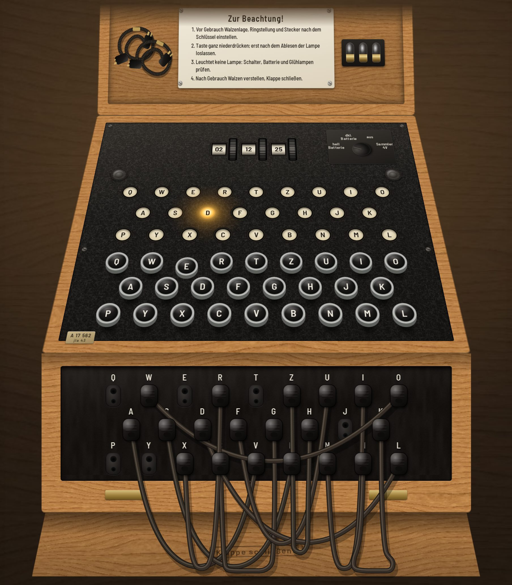

# Chiffriermaschine Enigma

A working Wehrmacht **Enigma I**, with Kriegsmarine **M3** and **M4** modes,
in one self-contained HTML file. It enciphers exactly like the real machine:
the historical wirings, turnover notches, ring settings, the three-pawl
double step, the non-stepping Greek wheel of the M4, and a reciprocal
plugboard that goes dead if a cable is left with one loose end. It is drawn
as the object: an oak case with its lid open, crackle-painted metal, raised
bakelite keys, a lampboard that glows while a key is held, knurled
thumbwheels turning numbered or lettered rings, and plug cables that hang,
swing and can be dragged between sockets. Every sound is synthesized.



## Use it

Open **`enigma.html`** in any modern browser. There is no build step, no
server and no network access: the fonts are embedded subsets and every
texture is generated in the page.

| To… | Do this |
|---|---|
| Encipher or decipher | Type on your keyboard, or press the keys with the mouse or a finger. The lamp stays lit while the key is held |
| Set the rotors | Drag a thumbwheel up or down, scroll over it, click its upper or lower half, or focus it and use the arrow keys |
| Rewire the plugboard | Drag a plug to another socket. Drop it anywhere else and it dangles, leaving its partner socket dead. Or click two empty sockets to join them with a spare cable, and press Enter on a plugged socket to take its cable out |
| Use a spare cable | Drag one of the two coiled spares out of the lid |
| Dim or switch off the lamps | Click the power switch: *hell Batterie → dkl. Batterie → aus → Sammler 4V* |
| Set a key | Fill in the **Maschinenschlüssel** (model, reflector, rotor order, rings, start, plug pairs) and press **Einstellen** |
| Watch a real message decipher | Pick one under **Funksprüche**. The machine sets the key, performs the indicator procedure, turns the wheels and types the message |
| Let the machine type | Paste text under **Eintasten** and press **Eintasten · type it** |

The machine opens on the real daily key of the Operation Barbarossa message
(7 July 1941) with ten cables plugged. The textbook check still works: set
Enigma I, UKW B, I II III, rings 01 01 01, start 01 01 01, no plugs, then
type `AAAAA` to get `BDZGO`.

## How it was built

1. **Research first**, in [RESEARCH.md](RESEARCH.md): wirings, turnovers and
   physical notches, ring settings, stepping, the plugboard, test vectors,
   and nine historical messages, each cross-checked across at least two
   sources and against four independent implementations. The notes also cover
   where sources disagree (for example, the two published Dönitz settings turn
   out to be equivalent), the physical design from museum and auction
   descriptions, and open questions.
2. **Specification and milestones**, in [SPEC.md](SPEC.md), written from the
   research before any code.
3. **The engine proven before any interface:** 67 tests with published
   vectors and properties, plus a mutation check.
4. **The interface in milestones**, each ending in screenshots compared
   against the research, with the mismatches fixed. See
   [docs/milestone-reviews.md](docs/milestone-reviews.md).

## Tests

```sh
npm install        # only Playwright, for the browser tests
npm test           # engine: vectors + property tests (no dependencies needed)
npm run test:mutants
npm run test:e2e   # the real page in Chromium
```

* **`npm test`** (67 tests) runs the engine code **extracted from
  `enigma.html` itself**. It covers every component table, `AAAAA → BDZGO`,
  two double-step sequences, and nine historical messages: the 1930 manual
  example with its doubled indicator, both parts of Barbarossa with their
  indicators, Scharnhorst, U-264 (including its final display `VJWY`),
  U-623, the HMS Hurricane intercept, the Dönitz message under both published
  settings, and U-534 P1030662. It also runs nine long messages verified on
  two independent simulators, and properties over randomised Enigma I, M3
  and M4 machines: reciprocity, no letter enciphering to itself, a
  fixed-point-free involution at every position, the M4 ≡ M3 identity,
  ring/position equivalence, the 16 900 period, the stepping invariants, and
  open circuits. `ENIGMA_SEED` and `ENIGMA_RUNS` vary the randomisation.
* **`npm run test:mutants`** injects 12 classic Enigma bugs, such as no
  double step, the ring applied to the notch, stepping after the contact, or
  one transposed letter in a rotor, into a copy of the page and confirms the
  suite catches every one.
* **`npm run test:e2e`** (20 tests) drives the page in Chromium. It checks
  typing against the engine, a lamp lit only while held, the thumbwheels, the
  power switch, plug dragging, loose ends and the lid spares, the key sheet,
  model switching, three historical messages deciphered **through the keys
  and lamps**, and the sound design: every event audible, none clipping, and
  a double step audibly busier.
* **`npm run screenshots`** writes the milestone screenshots with
  `tools/screenshot.mjs`. Add `--script=tools/shots/<scene>.mjs` to stage a
  scene first.

## Inside the file

`enigma.html` holds four blocks:

* `<style id="fonts">`: Barlow Semi Condensed (a DIN-like face for the
  machine's lettering) and Special Elite (typewriter, for the papers),
  subset and base64-embedded by `tools/embed-fonts.py`.
* `<style>`: the page and the machine, dimensioned in millimetres at
  3 px/mm and placed with CSS 3D under one perspective camera.
* `<script id="enigma-engine">`: the cipher, pure and DOM-free, exposed as
  `EnigmaEngine`.
* `<script id="enigma-ui">`: procedural textures, the machine's parts, the
  rotor-window and thumbwheel canvases, the Verlet-rope plug cables, the
  Web Audio synthesis, the key sheet and the historical archive. It also
  exposes a small `window.enigma` scripting surface for the console.

## Credits

* Wirings, procedures and messages: see the sources in
  [RESEARCH.md §7](RESEARCH.md#7-sources). They include Crypto Museum, Dirk
  Rijmenants, David Hamer, Tony Sale, Frode Weierud's CryptoCellar, Stefan
  Krah's M4 project, Michael Hörenberg, the Franklin Heath wiki, and the
  cross-checked implementations `py-enigma`, `crypto-enigma`, `enigmapython`
  and `@ondoher/enigma`.
* Fonts: **Barlow Semi Condensed** by Jeremy Tribby (SIL Open Font License
  1.1) and **Special Elite** by Astigmatic (Apache License 2.0).
