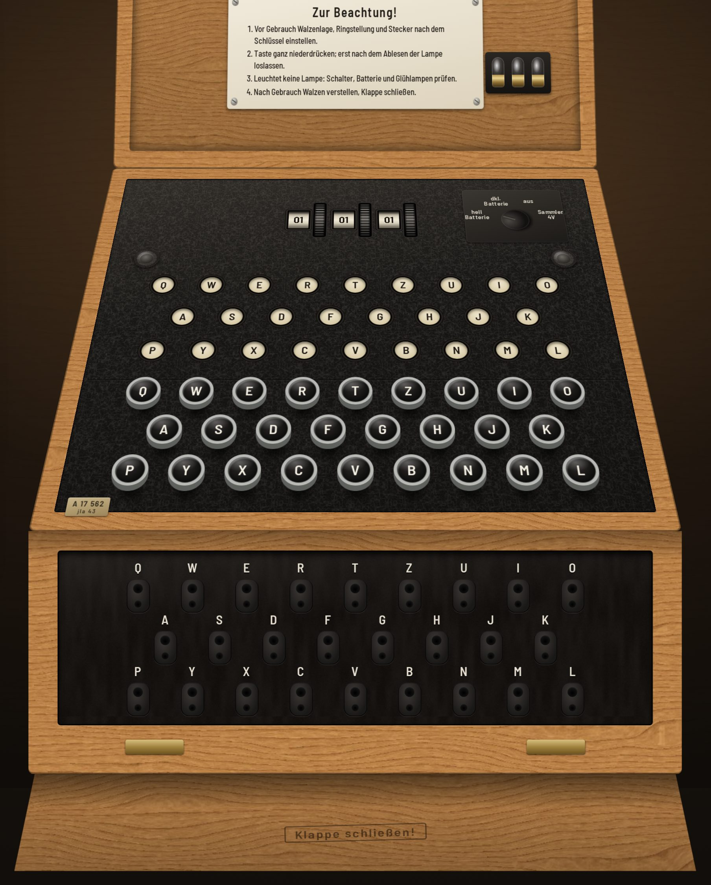
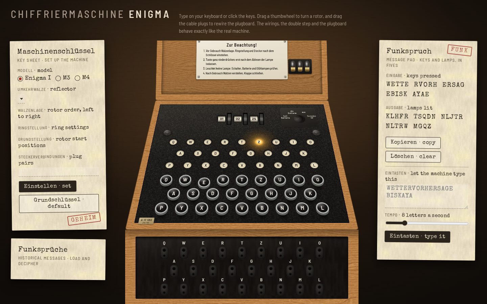
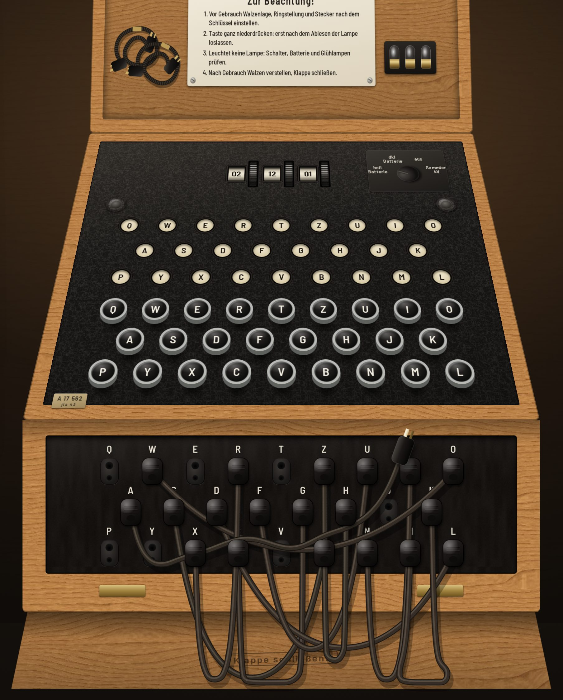
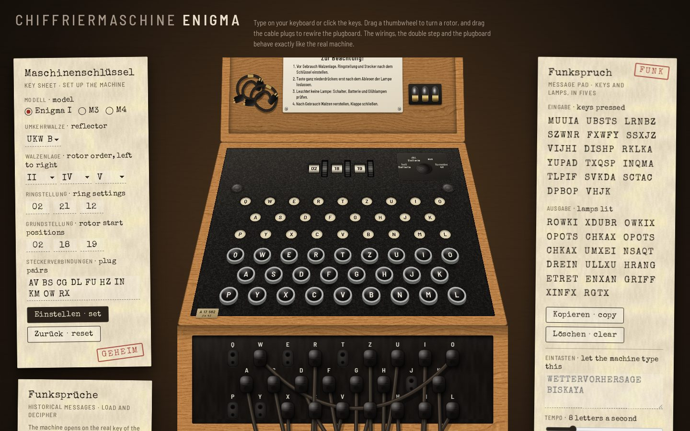
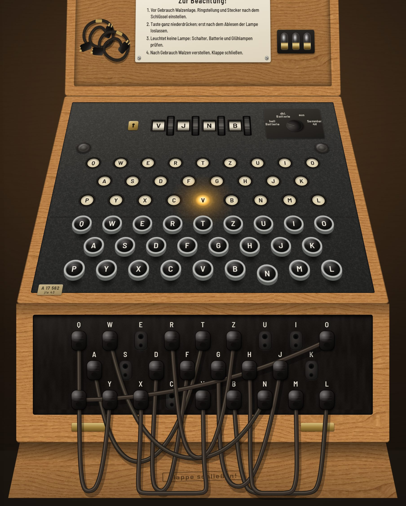
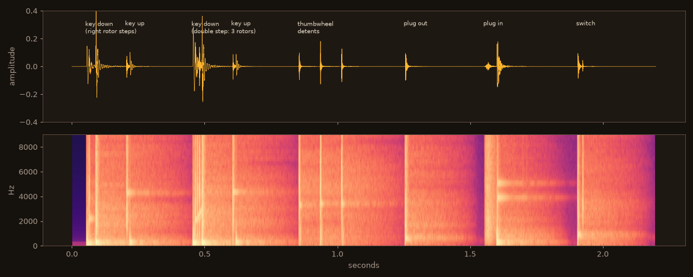

# Milestone reviews

A log of each milestone in [SPEC.md §6](../SPEC.md#6-milestones): what was
checked against [RESEARCH.md](../RESEARCH.md), what didn't match, and what
was fixed.

## M1: Engine proven

* `npm test`: **67/67 pass**. That covers the component tables, V1–V3, all
  nine historical messages H1–H9 (with indicator procedures, U-264's final
  display `VJWY`, and both published Dönitz settings), all nine synthetic
  vectors S1–S9, the API and validation contract, and properties P1–P9 over
  randomised Enigma I, M3 and M4 machines (seed printed; `ENIGMA_SEED` and
  `ENIGMA_RUNS` to vary).
* Every historical message passed on the first engine run. The engine was
  written from the rules in RESEARCH.md §1, not ported from the prototype or
  another implementation.
* **Mutation check** (`npm run test:mutants`): 12 classic implementation bugs
  were injected into a copy of the page. They were: no double step, the wrong
  rotor carrying the left, the ring setting applied to the notch, the ring
  applied in the wrong direction, stepping after encipherment, a stepping Greek
  wheel, the plugboard applied only on the way in, a single transposed letter in
  rotor VIII or in UKW C thin, a single-notch rotor VI, the forward wiring on
  the return path, and a thumbwheel that carries.
  * First run: **11/12 killed**. The thumbwheel test only turned wheels away
    from turnover letters, so a carry bug went unnoticed. The test now turns
    wheels onto, past and all the way round their turnover letters, and the
    rerun kills **12/12**.
* Test harness note: loading the engine in a separate `vm` realm made
  `deepStrictEqual` fail on arrays from the other realm (a harness problem,
  not an engine bug). The loader now runs the script in the test realm with a
  shadowed `globalThis`.

## M2: Static machine

The machine is drawn from the millimetre table in RESEARCH §4.8 and placed
with CSS 3D under one camera (eye above and in front, vertical image plane),
so the top plate recedes and the plugboard faces the viewer as in museum
photographs. The textures are procedural: plain-sawn oak with ray flecks,
wrinkle paint, ebonite and paper.

Checked against RESEARCH §4:

| Research point | Rendered | Result |
|---|---|---|
| Oak case, hinged lid, fall-front flap (§4.1) | oak rim, open lid leaning 10° back, flap lying forward stamped "Klappe schließen!" | ✔ |
| Black crackle paint (§4.2) | procedural wrinkle texture on the top plate | ✔ |
| Rotor windows with the thumbwheel to the **right** of each (§4.2) | 3 windows, a knurled wheel right of each | ✔ |
| Enigma I rings numbered 01–26 (§1.7) | windows read `01 01 01` | ✔ (after fix) |
| Power switch, 4 positions left→right (§4.2) | `hell Batterie · dkl. Batterie · aus · Sammler 4V` around a pointer knob | ✔ (after fix) |
| Fixing nuts either side of the cover (Powerhouse) | two knurled nuts | ✔ |
| Lampboard in QWERTZ, cream windows, black letters (§4.3) | 3 rows, 9/8/9 | ✔ |
| Keys: white on black, metal rim, raised on stems (§4.4) | 3D caps on stems, nickel rims | ✔ (after fix) |
| Plugboard: 26 sockets in keyboard layout, thick hole above thin (§4.5) | 9/8/9 sockets, letter labels, two holes each | ✔ |
| Lid: "Zur Beachtung!" plate, spare bulbs, green filter (§4.6) | plate (marked as a paraphrase), 3 bulbs, filter (cropped off by the lid framing) | ✔ |
| Serial plate, no logo (§4.2) | brass plate `A 17 562 / jla 43` | ✔ |

Mismatches found in the screenshots, and the fixes:

1. **Keys hid the bottom lamp row.** The camera keeps vertical distances at
   full height, unlike a tilted photographic camera, so the 18 mm stems
   towered over the plate. Stems are now 9 mm, and the lamp and key rows are
   3–4 mm further apart. All three lamp rows are visible.
2. **Rotor windows were illegible.** They showed "26/01/02" stacked, because
   the ring's label spacing on the drawn cylinder (≈11 px) was smaller than the
   glyph height. On the real ring it is ~12 mm for ~7 mm glyphs. The radius
   now matches that ratio, so a window shows one label and neighbours appear
   only while rolling.
3. **Power-switch labels overlapped each other and the knob.** The plate is
   larger, the labels sit further out on an arc, and the knob is lower.
4. **A fixing nut overlapped the switch plate**, so both were moved apart.
5. **"GEHEIM" stamp collided with the sheet title**, so it moved to the sheet's
   lower corner.
6. Uppercasing turned "Klappe schließen!" into "SCHLIESSEN". The stamp is now
   in mixed case and keeps the ß.
7. The machine sat below the fold on a 1440 × 900 desktop. The lid is cropped
   tighter and the side papers are narrower, so rotors, lamps, keys and
   plugboard all show without scrolling.

## M3: Live machine

* **Behaviour vs research:** the rotors step on key-down, **before** the lamp
  circuit closes (§1.1). The lamp lights about 28 ms later, at the bottom of
  the stroke, and **only while the key is held**. Holding a physical key does
  not auto-repeat, just as on the machine. The thumbwheels turn one rotor
  with **no carry** (§1.5). The power switch has four positions (§4.2):
  `dkl.` dims the lamps, while `aus` and `Sammler 4V` (no accumulator
  connected) leave them dark even though the rotors still step. The pad then
  explains why nothing lit.
* **Windows:** after typing 24 letters from `01 01 01`, the windows read
  `01 02 25`. The middle rotor was carried once, when III passed its turnover
  V, as the stepping rule requires.
* **E2E** (`npm run test:e2e`), **7/7 pass:** no errors and no network
  requests; physical-keyboard typing equals the engine, including
  `AAAAA → BDZGO`; a lamp lit only while held; mouse presses; thumbwheels by
  drag, arrow keys and scroll wheel with no carry, and numbered labels;
  power-switch behaviour; auto-typing through the keys.
* **Fixed after review:** the lit lamp read as a flat orange disc with a pale
  letter. A lamp behind celluloid glows white-hot at the centre with the
  letter in dark silhouette, and throws a wide halo on the paint. The glass
  gradient, the letter colour and the bloom were redone to match.
* Left for M5: the key-sheet fields are still empty, one sheet button label
  wraps, and the pad subtitle runs under the "FUNK" stamp.

## M4: Plugboard and cables

* **Physics:** each cable is a 30-segment Verlet rope with gravity, light
  bending stiffness and friction where it rests on the flap. Seated plugs pin
  their ends to the sockets, and a held plug pins its end to the pointer. The
  simulation sleeps once everything is still.
* **Behaviour vs research (§1.6, §4.5):** both ends seated make a reciprocal
  pair. A plug pulled from one end leaves a **loose end**: the socket still
  holding the other plug has its shorting bar lifted, so it is an **open
  circuit**. The engine models this, so no lamp lights and the pad explains
  why. The rotors still step. Twelve cables are supplied: ten plugged (1939+
  practice) and **two spares clipped in the lid**, as on the Sotheby's machine.
  A spare can be dragged straight out of the lid.
* **Interaction:** drag a plug between sockets; drop it anywhere else and it
  falls and dangles; click (or press Enter on) two empty sockets to join them
  with a spare; press Enter on a plugged socket to take its cable out (for
  keyboard and touch users).
* **E2E:** 13/13 pass. The six new tests cover the default wiring, drag
  rewiring with typing that follows it, a loose end giving no lamp while the
  rotors still step, click-to-connect with a lid spare, taking a cable out
  with the keyboard, and dragging a spare from the lid.

Mismatches found and fixed:

1. **Cables fell straight down into a zig-zag tangle** on the flap. The first
   model stopped all motion in a "flap zone", which folded the ropes. Real
   photographs show U-loops hanging in front of the panel, so gravity now acts
   everywhere and only the flap's front edge acts as a floor. The loops now
   match the photographs.
2. **Cable length.** The documented 20 cm can't be pin-to-pin, because
   sockets 28 mm apart would put far pairs (Q–L ≈ 23 cm) out of reach, yet
   key lists paired any letters. The model uses about 20 cm of cable plus the
   plug bodies (680 design px ≈ 23 cm). Adjacent pairs hang about 10 cm and
   the far corners pull almost taut. Recorded as an estimate (RESEARCH §6.3).
3. **Loose spares lying on the flap** looked like clutter and didn't match
   the machine as found. Spares now live in the lid, as on the Sotheby's
   example.
4. **Used spares did not disappear from the lid.** SVG elements have no
   `.hidden` property, so the attribute is now toggled directly, with a global
   `[hidden]` rule.
5. Test artifact: a smoke script dragged from sockets below the viewport, so
   the plugboard tests now scroll sockets into view first.

Accepted as realistic: cables crossing sideways cover some socket letters, as
on the real board. Every socket keeps an accessible label and lights up on
hover while a plug is being carried.

## M5: Models, key sheet and historical messages

* **Key sheet (Maschinenschlüssel):** model, UKW, Walzenlage, Ringstellung,
  Grundstellung and Steckerverbindungen. It offers only each model's own
  components (R§1.7) and validates through the engine, so "Each rotor can
  only be used once" and "A is plugged more than once" appear as readable
  notes. Applying a key swaps the wheels, rolls the windows, and re-plugs the
  cables with animation, returning unused cables to the lid. The start
  positions and plug pairs on the sheet follow the machine live.
* **Models:** Enigma I has numbered windows and black crackle paint. M3 has
  lettered windows and the Navy rotor set. M4 has four lettered windows (the
  Greek wheel leftmost), a **lockable rotor cover** and grey-black paint (R§4.7).
  Choosing a model swaps in its standard wheels at once and leaves the cables
  in place.
* **Historical messages:** 1930 manual, Barbarossa ×2, U-264, Scharnhorst
  and Dönitz. Loading one sets the key, performs the **indicator procedure**
  on the machine (1930: the doubled key `PKPJXI → ABLABL`; 1941: `WXC KCH →
  BLA`), turns the thumbwheels one detent at a time, and types the message
  through the keys and lamps. It then shows a reading with word breaks, an
  English translation and the source. Navy messages start from the recovered
  message key, with a note that their indicators used bigram tables (R§1.8).
* **E2E: 19/19 pass.** The new tests cover model switching (window count,
  numbers or letters, M4 lock, default wheels), the sheet setting a key and
  following the rotors, refusals of impossible keys, and **H1, H2 and H5
  deciphered through the UI**, matching the published plaintext exactly
  (U-264 ends on `VJWY`).

Mismatches found and fixed:

1. **Cables tied themselves in knots after re-plugging.** Dragging only the
   plug ends through the simulation bunched the rope, and floor friction froze
   the bunches into curls. A re-plug now eases the whole cable into its
   pre-settled hanging shape (the same physics, run on a scratch rope), then
   hands back to the simulation for a small settling swing.
2. **The "GEHEIM" stamp covered the hint text.** The hint moved to the
   Funksprüche card, where it belongs.
3. **Long messages stretched the pad down the page.** The pad scrolls
   internally now and keeps the newest letters in view.
4. **Ten plug pairs were cut off** in a one-line field. It is now a two-line
   typed field.

## M6: Sound

All sounds are synthesized with Web Audio from filtered noise bursts and
damped tones. They pass through a short, dark "wooden case" convolution
(an impulse generated in code) and a compressor. There are no samples. The
audio context starts on the first interaction, and the Ton switch and volume
are remembered in `localStorage`, guarded so the page works without it.

| Event | Built from | What it models |
|---|---|---|
| Key down | lever thud, then **one ratchet tick per stepping rotor** (8 ms apart), then the bottoming clack | the pawls throwing the rotors before contact (R§1.1). A double step is audible as extra ticks |
| Key up | a bright click, a faint spring ring, and a knock on the upper stop | the key springing back |
| Thumbwheel | a crisp tick per detent | 26 detents a turn |
| Plug in | a short scrape, then a dull knock plus a small metallic ring | pins sliding in and seating |
| Plug out | a pop and release | |
| Power switch | a detent clack | |

Review method: I can't listen in this environment, so every event is
rendered offline through the same graph (`window.enigma.renderSounds`) and
checked as a waveform and spectrogram (above). The E2E suite asserts that
every event is audible and never clips, and that a three-rotor step carries
at least 1.6× the tick energy of a one-rotor step.

Fixed after review:

1. **The thumbwheel detent was nearly inaudible** (peak 0.012 on its own).
   The new E2E audibility check caught it. It is now a brighter, fuller tick.
2. **Ratchet ticks ran into the bottoming clack** (5.5 ms spacing, clack at
   24 ms), so a double step barely stood out. The ticks are now 8 ms apart,
   the clack comes at 34 ms, and the key sounds are 40 % louder.
